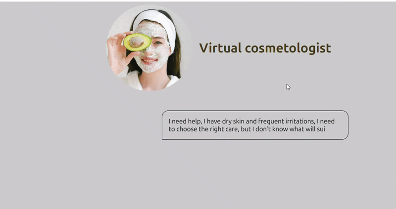

  <h1>Virtuelle Kosmetologin</h1>

  

  

  

## 🛠️ Über die App
Diese Anwendung hilft Nutzerinnen dabei, passende Pflegeprodukte für ihre Haut zu finden, ohne das Haus zu verlassen. 
Die Benutzerin beantwortet mehrere Fragen zu ihrem Hauttyp, und anschließend erhält sie eine individuelle Produktempfehlung.

## 🧠 Funktionsweise
Alle Produktdaten sind in einem JavaScript-Objekt strukturiert. 
Abhängig von den Antworten der Benutzerin werden verschiedene Funktionen aufgerufen und die entsprechenden Ergebnisse dynamisch angezeigt.

## 🧩 Technische Details
- Dynamische DOM-Manipulation
- Bedingte Anzeige von Inhalten
- Arbeit mit Objekten und Arrays
- Verarbeitung von Benutzereingaben

## 🔧 Sprachen und Tools
HTML  
CSS  
JavaScript  
GSAP

## 📚 Das habe ich gelernt
In diesem Projekt habe ich gelernt:
- Daten in Objekten zu strukturieren
- Funktionen zu schreiben und über Button-Klicks aufzurufen
- Inhalte dynamisch ein- und auszublenden
- Logikfehler zu erkennen und zu beheben

## 🚀 Zukünftige Verbesserungen
- Anbindung einer echten Produktdatenbank
- Speichern der Benutzereingaben (Backend)
- Verbesserung des Designs
- Responsive Layout für mobile Geräte

## 📝 Hinweise
Dieses Projekt kann zu Lern- und Übungszwecken verwendet werden.

## 🌐 Live-Demo
https://virtual-beautican-en.netlify.app/

  <h1>Virtual Cosmetologist</h1>

  

## 🛠️ About the App
This application helps users choose suitable skincare products without leaving home. 
The user answers several questions about their skin type and preferences, and then receives a personalized list of recommended products.

## 🧠 How it works
All product data is structured inside a JavaScript object.  
Based on the user’s answers, the application calls different functions and dynamically displays the corresponding results.

## 🧩 Technical details
- Dynamic DOM manipulation
- Conditional rendering
- Working with objects and arrays
- Basic user input validation

## 🔧 Languages and Tools
HTML  
CSS  
JavaScript  
GSAP

## 📚 What I learned
While developing this project I learned:
- how to structure data inside objects
- how to write functions and call them on user actions (button clicks)
- how to show and hide content dynamically
- how to fix application logic errors and restart the process when needed

## 🚀 Future improvements
- add real product database
- add backend and saving user results
- improve UI design
- add mobile responsive layout

## 📝 Notes
This project may be used for educational purposes.

## 🌐 Live Demo
https://virtual-beautican-en.netlify.app/

